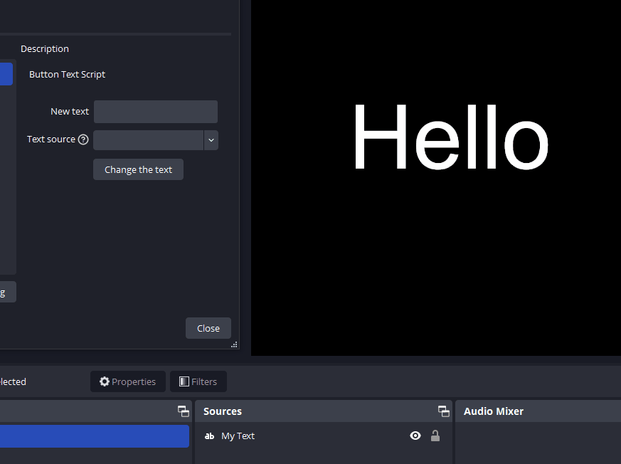
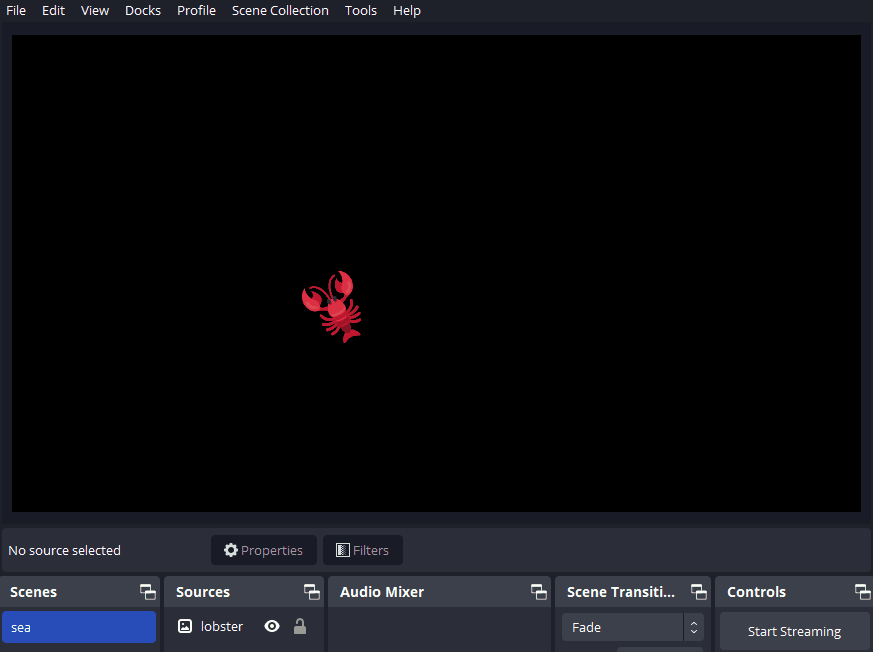

# Lobster 🦞

Intuitive OBS scripting with a LÖVE inspired API wrapper.

[Getting started](doc/getting_started.md) | [API](doc/api.md) | [Examples](#examples)

## About
Lobster aims to simplify OBS Lua scripting by providing an intuitive API wrapper, inspired by the API of the [LÖVE](https://github.com/love2d/love/) framework. It saves the user from having to deal with the OBS API directly, and allows for a more object-oriented approach.

Lobster is far from complete, covering the most important features, but still missing a large part of the OBS API at the moment. Using the foundation that is layed out it is easy to add new features. Until that time, missing features can be filled up by using the OBS API directly in combination with Lobster.

## Purpose

A utility script you plan to share with others probably shouldn't use Lobster, unless the project is of reasonable size. Scripts that changes the text of a single source,  or add a hotkey to toggle an item, are better off using the OBS API directly to keep the script small.

Lobster is meant for scripts that are more complex. For personal scripts that fit your specific needs. That is the very reason Lobster was made in the first place.

## FAQ

* Q: I need help! Where can I go?

    Send me a DM on [X](https://x.com/sheepolution) or on Discord. You can find me (`sheepolution`) in the [OBS Community server](https://discord.com/invite/obsproject). Do **NOT** ask questions about Lobster in the server. They are there to answer questions about the API, not about this framework.

* Q: OBS crashes when I close it. How come?

    This is most likely caused by a source that has not been released properly. Unless you used the OBS API directly, this a bug in Lobster. [Please report it](https://github.com/Sheepolution/lobster/issues).

* Q: How can I do *x*, I can't find it in the documentation?

    That probably means the feature you're looking for is not implemented yet. [You can make a request](https://github.com/Sheepolution/lobster/issues)

* Q: Is there a Python version of Lobster?

    No. I invite you to be the first to make a port, and I will link it here.

## Examples

### Hide/reveal an item every 5 seconds.
```lua
require "lobster.lobs"

local visible = true

function lobs.ready()
    lobs.timer.addTimer(function()
        local item = lobs.scene.getItemByName("webcam")
        if item then
            visible = not visible
            item:setVisible(visible)
        end
    end, 5000)
end
```

### Create a filter and add it to a source
```lua
require "lobster.lobs"

function lobs.ready()
    local filter = lobs.source.newFilter("Brightness", "color_filter", { brightness = 0.1 })
    local source = lobs.source.getSourceByName("webcam")
    if source then
        source:addFilter(filter)
    end
end
```

### Create properties to change the text of a specified source
```lua
require "lobster.lobs"

local target_name
local change_text

function lobs.settings.on_update(properties)
    target_name = properties.source
    change_text = properties.change_text
end

lobs.settings.setProperties(
    {
        {
            type = "text",
            id = "change_text",
            name = "New text",
            text_type = "default",
            default = "I have changed!",
        },
        {
            type = "list",
            id = "source",
            name = "Text source",
            description = "The text source to change",
            list_type = "editable",
            format = "string",
            -- Fill the list with Text GDI+ sources
            source_options = { ["text_gdiplus"] = true }
        },
        {
            type = "button",
            id = "change_text_button",
            name = "Change the text",
            callback = function()
                if not target_name then
                    return
                end

                local source = lobs.source.getSourceByName(target_name)

                if source then
                    source:setProperty("text", change_text)
                end
            end
        },
    }
)
```


### Increase a number each time a hotkey is pressed
```lua
require "lobter.lobs"

function lobs.load()
    lobs.hotkey.register("counter_increase", "Counter increase")
end

function lobs.hotkey.on(name, pressed)
    if not pressed or name ~= "counter_increase" then
        return
    end

    local source = lobs.source.getSourceByName("Counter")
    if not source or source:getType() ~= "text_gdiplus" then
        return
    end

    local count = source:getProperty("text")
    count = tonumber(count)
    source:setProperty("text", tostring(count + 1))
end
```

### Move around a lobster using hotkeys

```lua
require "lobster.lobs"

function lobs.load()
    lobs.hotkey.register("turn_left", "Turn left")
    lobs.hotkey.register("turn_right", "Turn right")
    lobs.hotkey.register("move_forwards", "Move forwards")
end

local lobster

function lobs.ready(scene)
    lobster = scene:getItemByName("lobster")
    if lobster then
        lobster:setAlignment("center")
    end
end

function lobs.update(dt)
    if not lobster or not lobster:exists() then
        return
    end

    lobster:useItem(function()
        local position = lobster:getPosition()
        local rotation = lobster:getRotation()

        if lobs.hotkey.isDown("turn_left") then
            rotation = rotation - 5 * dt
        end

        if lobs.hotkey.isDown("turn_right") then
            rotation = rotation + 5 * dt
        end

        if lobs.hotkey.isDown("move_forwards") then
            position.x = position.x + math.cos(rotation) * 400 * dt
            position.y = position.y + math.sin(rotation) * 400 * dt
        end

        lobster:setPosition(position)
        lobster:setRotation(rotation)
    end)
end
```
